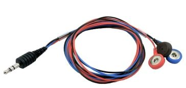
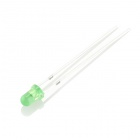
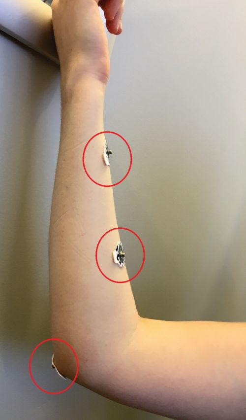

Getting Started
===============

We will use the following parts, which are located in your bin or at the table. The bin will contain additional parts that you will use tomorrow. No need to take the parts out now…just get started!

|                                  |                                                    |                     |                             |
|----------------------------------------------------------|----------------------------------------------------------------------------|---------------------------------------------|-----------------------------------------------------|
| Arduino microcontroller board (our miniature computer)   | EMG muscle sensor (measures the tiny electrical signals from your muscles) | EMG muscle sensor button wires w/ mini-plug | Motor driver board (electronics to drive the motor) |
|                                                          |                                                                            |                                             |                                                     |
|                                  |                     |                             |
| Sensor pads (connect the EMG muscle sensor to your skin) | Motor                                       | 12V battery for motor                               |
|                                                          |                                                                            |                                             |                                                     |
|                                  |                                                   |                    |                            |
| LED                                                      | Potentiometer                                                              | LCD display + JST cable                     | USB cable                                           |
|                                 |                                                   |                    |                            |
| Aluminum beam                                            | Screws                                                                     | Motor hub                                   | Breadboard                                          |
|                                                          |                                                                            |                                             |                                                     |
|                                 |                                                   |                                             |                                                     |
| 3/32” and 7/64” Hex wrenches                             | Screwdriver                                                                |                                             |                                                     |

Our first Arduino system
========================

For our first system, we’ll use Arduino to control something, in this case the brightness of a LED.

1.  Attach the motor driver board to the Arduino microcontroller board by aligning the pins from the motor driver board with the black headers on the Arduino board and pushing the two boards together. The motor driver board is called a *shield*, in that it fits on top of the Arduino, kind of like a shield.

	 

1.  Connect the Arduino, LED, and a 220 Ω resistor (from the cabinet in the back of the lab) in series, as shown in the image and schematic below. (Our schematics show the Ardinuo board rather than the motor shield attached on top, but we are in fact connecting the wires to the motor shield). Remember that the LED is polarized; connect the short lead to the resistor and the long lead to the wire going to the Arduino digital pin 6. Note in the schematic and image that we used two wires to bring +5V and gnd from the Arduino to the breadboard.

	 

1.  If not already logged in, log in to the computer. Double-click on the Arduino icon  on the desktop to open up the Arduino programming environment. Open up the LEDControl sketch (File&gt;Open, navigate to Desktop, LEDControl folder, LEDControl.ino).

2.  Every Arduino program (sketch) has three basic parts. The first part defines constants, variables, and other miscellanea. In our case, we assign the value 6 to ledPin. The second part is a block of statements enclosed within curly brackets starting with void setup(). This block runs once when the Arduino powers up. In our case, we have the pinMode command to tell the Arduino which pin is connected to the LED and to set that pin to be an OUTPUT (rather than an INPUT).

The third part is the void loop() block. This block loops over and over forever. Here we have two commands, analogWrite to set the output voltage at the output pin to a particular value, then delay to wait before looping again. analogWrite sets the pin voltage to between 0 and 5 V, depending on the value given between 0..255 (0 0 V, 255 5 V).

1.  Connect the Arduino to the computer using the USB cable.

2.  Click the Upload button in the Arduino environment (). The sketch will compile and then be transferred to the Arduino. In a few seconds, you should see your LED light up.

Add in a potentiometer to control the LED brightness
====================================================

Instead of setting the brightness in the software, let’s instead use a potentiometer to adjust the LED brightness. We’ll use the potentiometer to create a variable analog voltage, read that voltage with the Arduino, and use that value to set the LED brightness.

1.  Disconnect the USB cable from the Arduino. Add in a potentiometer, with one outer leg connected to +5V and the other outer leg connected to gnd, and the middle leg connected to analog input pin 0 (A0). Reconnect the USB cable.

	

1.  Open the LEDControlWithPot sketch and look at it alongside the LEDControl sketch. **DO NOT UPLOAD YET!** You’ll notice a few new lines. We now define the pin to which the potentiometer is connected (potPin) and define a variable to hold the voltage that we’ll measure (potValue). In the loop(), we first read that voltage on that pin with analogRead. When we read the analog voltage, it is converted into a digital value that ranges between 0..1023 (0 0 V, 1023 5 V). We then use that value to set the voltage on the ledPin. However, we can only set outputs between 0..255.

2.  Edit the divisor value near the top of the sketch based on your result. That value is used in the analogWrite command near the end of the sketch.

3.  Upload the sketch and try it out! (Note that there are much simpler ways to use a potentiometer to control an LED’s brightness, but we’re on a journey here, so bear with us).

Add in an LCD screen
====================

It’s nice to have the Arduino communicate with us via text. A good way to do that is to attach an LCD display. Here we’ll attach a display and then have it display the LED brightness.

1.  Disconnect the USB cable from the Arduino to power off the Arduino. Attach the LCD screen to the breadboard and wire it up as shown in the schematic below (**note that the backside of the LCD is shown. The text will be on the front!)**. Reconnect the USB cable.

	

1.  Open the LCDAndLED sketch alongside the LEDControlWithPot sketch. Now there are new commands to control the LCD screen. The key commands are lcd.clear(), lcd.print(), and lcd.setCursor()in the loop. The code displays the value written with analogWrite. Upload the sketch. Vary the potentiometer to make sure everything works.

Attach the EMG sensor
=====================

Using a potentiometer to vary the LED is neat, but we’re here to do some neural interfacing! So let’s use our muscle to control the LED.

1.  Disconnect the USB cable from the Arduino. Disconnect the potentiometer, LED, and LCD screen wires from the motor shield.

2.  Attach an EMG shield on top of the motor shield. Use the EMG shield labeled **EMG1**. Plug a sensor cable into the EMG shield.

3.  Reconnect the LCD screen and LED into the EMG shield. You can look back to earlier in the lab handout to remind yourself of how everything is connected.

	

1.  Attach three sensor pads to each partner’s forearm or bicep muscles as shown below. One of the pads should go on the center of the muscle, one near the end of the muscle, and the third on the bony part of your elbow.

	

1.  Clip the three sensor buttons from the EMG muscle sensor wires to the pads on your bicep, with the black sensor button (reference button) attached to the pad near your elbow.

	

1.  Now we need to tell the code to rectify and smooth the signal from the EMG muscle sensors. In the LCDAndLED code, uncomment lines 43 and comment line 39 (by adding // to the beginning of the line). Connect the Arduino in and upload the new code.

2.  Now the LCD display should give the reading from your muscle. Flex the muscle. The reading should go up, and the LED should get brighter! If it doesn’t get help from the staff. You have just made a muscle-controlled light dimmer!

Add in the motor
================

OK, let’s put it all together. Instead of just controlling the LED brightness, let’s control a motor rotation rate. First we’ll build up the motor hardware, then make it spin!

1.  Slide the motor hub onto the motor shaft with the flat side of the hub facing up. The top of the hub should be flush with the top of the motor shaft. Use a 3/32” hex wrench to tighten the set screw so that it is tight.

	

1.  Attach the short aluminum beam to the clamping hub using two screws. You can attach the beam anywhere (end, middle, whatever). Tighten the screws using a 7/64” hex wrench. Attach motor to a flat surface using the double-stick tape on the motor’s bottom.

	

1.  Connect the four wires from the motor to the motor shield as shown in the diagram below.

	 

1. Here is the picture of the complete setup. Note that we also brought out the 12V battery for the motor.

	

1.  Open up the EMGToMotor sketch and look at it alongside LCDAndLED. When compared to the LCDAndLED sketch, there are extra lines to control the motor, and we have added in a calibration step. We have also renamed the variable potPin to EMGPin.

	There are some initial commands to create a motor shield object. The key motor control commands are setSpeed, which sets the rotation rate, and step, which dictates how many steps the stepper motor should take. We’ll learn more about stepper motors next time, but for now the key is that they take discrete steps as they rotate around (our motor has 200 steps for each complete revolution). In the step command, one can set the direction (FORWARD, BACKWARD), and the type of rotation (options are INTERLEAVE, SINGLE, DOUBLE, and MICROSTEP).

	Each EMG sensor gives different readings depending on, for example, where the electrodes are placed. To account for this, the code now has a for loop that iterates 10×. During each iteration, it rotates the motor a bit, reads the EMG signal, and displays the value on the LCD. We then average those 10 values to get a sense of the noise in the sensor (noiseThreshold).

	In the loop() block, we use the map command to map the measured signal as shown below. In this fashion, EMG signals below threshold will result in negative values of scaledEMG. This is just a fancier mapping akin to what we did before with the LED, when we divided potValue by 4.

	

1.  Power up the motor shield using the 12V battery. **CAUTION! The Motor can get quite hot!**

2.  See how fast you can make the motor rotate. Compare how many revolutions each partner can make in 30 sec. When switching partners, you can reset the Arduino by pushing the reset button near the power connector on the motor shield.

Next, try to flex your muscle hard for 30 sec and then see how fast you can make the motor rotate. Muscle fatigue, anyone?

1.  If you are in the first morning session, please disassemble your setup and circuit and put it back in the box. If you are in the second morning session, please leave it assembled for use on Day 2.

**Either way, please disconnect the 12V battery from the motor. **
