Getting Started
===============

You will need the following parts, which should be located in your bin.

| 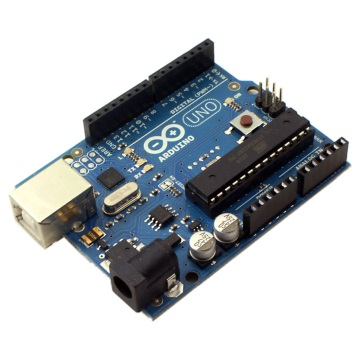                                 |                                                    | 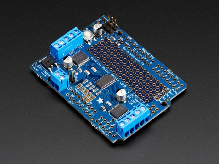                    | 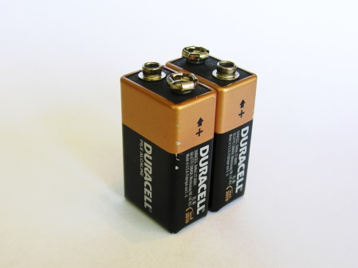                            |
|----------------------------------------------------------|----------------------------------------------------------------------------|---------------------------------------------|-----------------------------------------------------|
| Arduino microcontroller board (our miniature computer)   | EMG muscle sensor (measures the tiny electrical signals from your muscles) | EMG muscle sensor button wires w/ mini-plug | Motor driver board (electronics to drive the motor) |
|                                                          |                                                                            |                                             |                                                     |
| 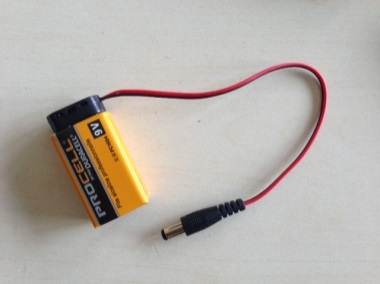                                 |                     | 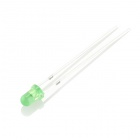                            |
| Sensor pads (connect the EMG muscle sensor to your skin) | Motor                                       | 12V battery for motor                               |
|                                                          |                                                                            |                                             |                                                     |
|                                  | 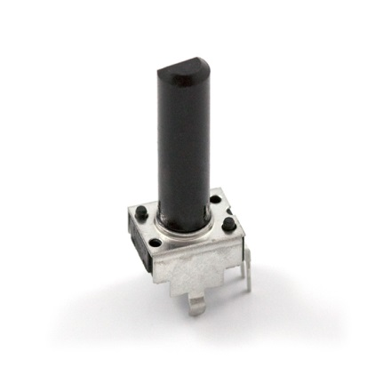                                                  | 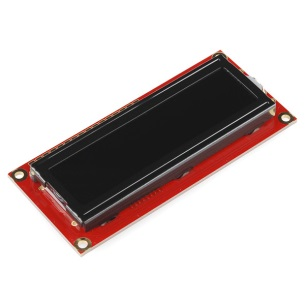                   | 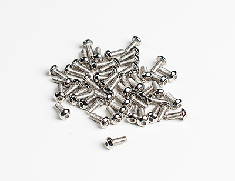                           |
| LED                                                      | Potentiometer                                                              | LCD display + JST cable                                 | USB cable                                           |
| 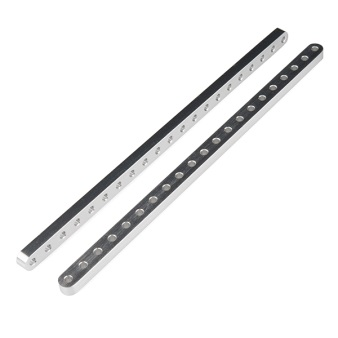                                |                                                   |                    | 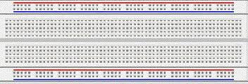                           |
| Aluminum beams                                           | Screws and nuts                                                            | Motor hub                                   | Breadboard                                          |
|                                                          |                                                                            |                                             |                                                     |
| 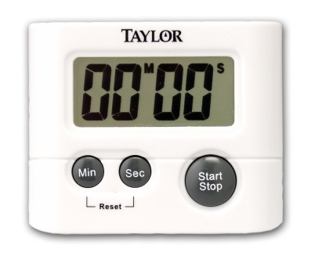                                | 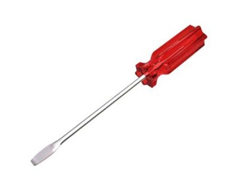                                                  | 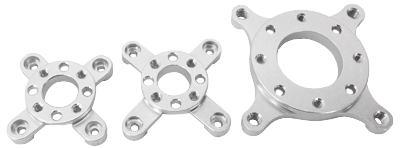                   | 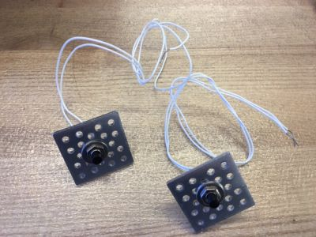                           |
| 3/32” and 7/64” Hex wrenches                             | Screwdriver                                                                | Motor mount                                 | Pushbutton switches on square plates (2)                               |
|                                                          |                                                                            |                                             |                                                     |
| 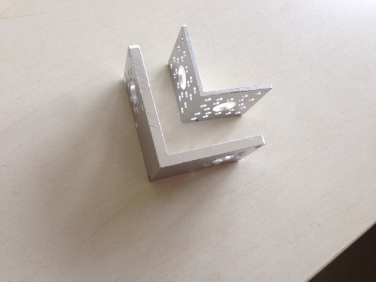                                |                                             |                                                     |
| Right-angle brackets                                     |                                             |                                                     |

Start up and test the system from Day 1
===========================================

1.  Double-click on the Arduino icon  on the desktop to open up the Arduino programming environment. Open up the EMGToMotor sketch (File&gt;Open, EMGToMotor folder, EMGToMotor).

2.  Take a look at the circuit to make sure no wires have come loose.

3.  Connect the Arduino to the computer using the USB cable. In the Arduino environment, go to Tools&gt;Port and select the serial port to which the Arduino is connected, e.g., display something like (Arduino Uno) COM4.

4.  Upload the sketch to the Arduino. After a few seconds, the LCD display should start displaying text as it did on Wednesday (“Calibration”,…).

5.  Connect the 12V battery to the Motor Shield. The green light on the motor shield should light up.

6.  Attach three sensor pads to your arm (one to the bony part of the elbow, and two others to the midpoint and endpoint of the forearm or bicep).

7.  Clip the three sensor buttons from the EMG muscle sensor wires to the pads on your bicep, with the black sensor button (reference button) attached to the pad near your elbow.

8.  Press the Arduino reset button. Make sure you are able to get a good EMG signal and cause the motor to rotate. If not, get staff help.

Add in a switch
===============

Let’s add in a pushbutton switch to get some additional functionality. We’ll use a switch to control the direction of the motor. The motor will spin one way when the switch is not pressed, and the other way when we press the pushbutton.

1.  Disconnect the Arduino from the computer.

2.  Add a pushbutton switch to the circuit as shown in the schematic below. Use a 10K resistor between digital input 1 and ground.

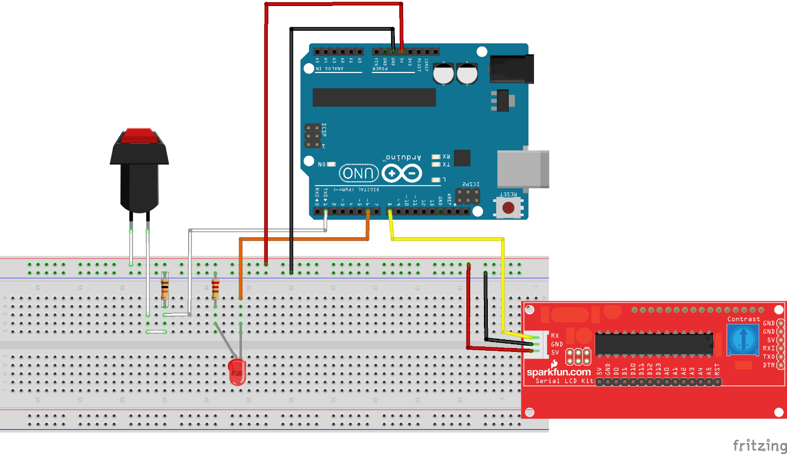

1.  Open the EMGToMotorWithSwitch sketch. We define button as a constant 1 (because the switch is connected to digital pin 1). Then, in the loop(), we use check the state of the switch with digitalRead(button) and assign that value to the variable buttonState. We then use an if statement with buttonState to control the direction of the motor in the step command.

2.  Connect the USB cable to the Arduino. Upload the sketch.

3.  See if you can change the direction of the motor.

Build Wrestlebrainia mini
=========================

Let’s assemble Wrestlebrainia mini. There are a number of ways to put it together. One method is presented here. Feel free to do it your own way, or check out the assembled version and use that as a guide.

1.  Attach the motor mount to the motor with the 4 included Philips-head screws.

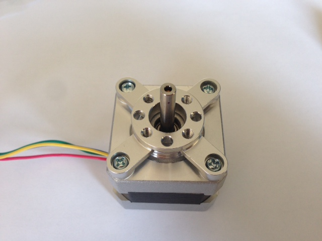

1.  Attach the two right-angle brackets to the motor using two hex-head screws.

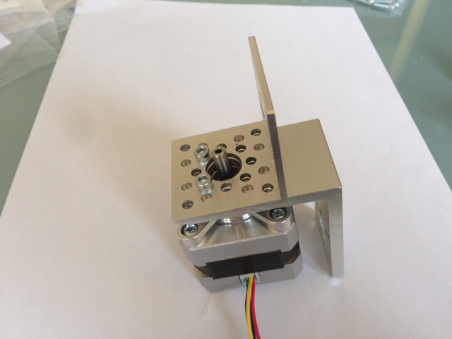 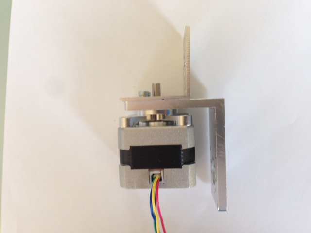 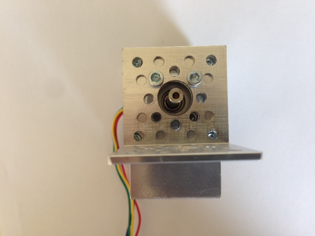

1.  Attach the short aluminum beam and motor hub to the shaft, similar to what you did on Wednesday.

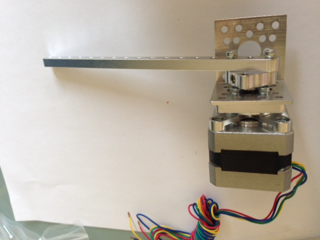

1.  Attach the long aluminum beam and the two switches to the right-angle bracket using hex-head screws and nuts. Before tightening the nuts holding the switches to the long aluminum beam, rotate the square plate holding the switch so that the short beam attached to the motor lands squarely on the switch.

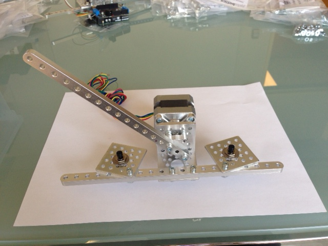

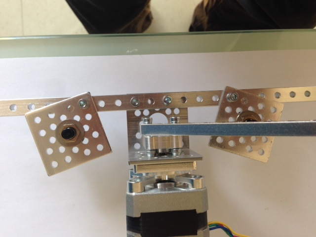

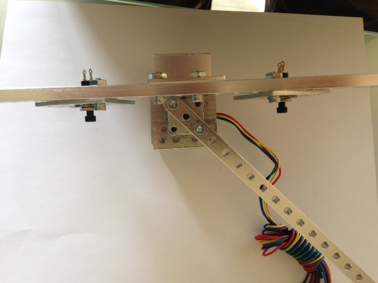

1.  Wire up the two pushbutton switches as you did in the previous section (thru 10K resistors to ground). Looking at Wrestlebrainia mini head-on, the circuit for the pushbutton on the left should go to digital pin 2, and the one on the right to digital pin 1.

2.  Attach the second EMG board (labeled **EMG2**) to the system similar to the first board. Player 1 should be on the left and should connect themselves to board EMG1. Player 2 will be on the right, and should be connected to board EMG2.

1.  Wrestle!
    ========

    1.  Open up the wrestlebrainiaMini sketch. Look at it side-by-side with EMGToMotorWithSwitch. In the first block of code, there are now two sets of variables and constants, one for Arm1 and one for Arm2. The button on the right is known as Player 2’s win button: it is the button that is pushed when Player 2 (the player on the right) rotates the motor arm all the way to Player 1’s side.

In the setup() block, we first find the two pushbuttons with the goToMiddle() procedure and then run a calibrate() procedure. In this sketch, we have many subfunctions (or subprocedures or subroutines) defined at the bottom of the sketch. If you scroll down, you can see what calibrate() does. It is essentially a fancier version of the calibration from EMGToMotorWithSwitch.

In the loop() block, we read the two EMG signals and store them in a type of array called a queue, which keeps the 50 most recent data points. This code uses a more sophisticated calibration that what we have used before. It is an *adaptive* calibration, where the minimum and maximum values vary over time. Most of the code in the loop() block deals with figuring out what is a good max and min value for each Arm. Once those are determined, we scale our current measurement to between 0..99 using a mapping similar to below:

Then we compare the two EMG signals and the difference determines the motor direction and velocity. We move a step in that direction at that velocity, then run the subfunction checkForWinner(), which checks to see if one of the buttons has been pushed. If so, we run a celebrate() subroutine, which moves the motor arm back and forth and blinks the LED, and then goToMiddle() again. If there is no winner, we loop through again.

1.  Connect the USB cable to the Arduino. Upload the sketch.

2.  Have fun!

3.  Things to do

-   Wrestle, wrestle, wrestle. Try different muscles.

-   Feel free to mess with the adaptive calibration, such as the two filterFactors

-   What else can you do with a motor, some hardware, 2 switches, and 2 EMG boards?

Clean up
========

1.  If you are in the first morning session, please take the wrestlebrainia mini hardware apart, and remove the two switches from the circuit. Put the parts back in the bin. If you are in the second morning session, please take everything apart and put it back in the bin.
