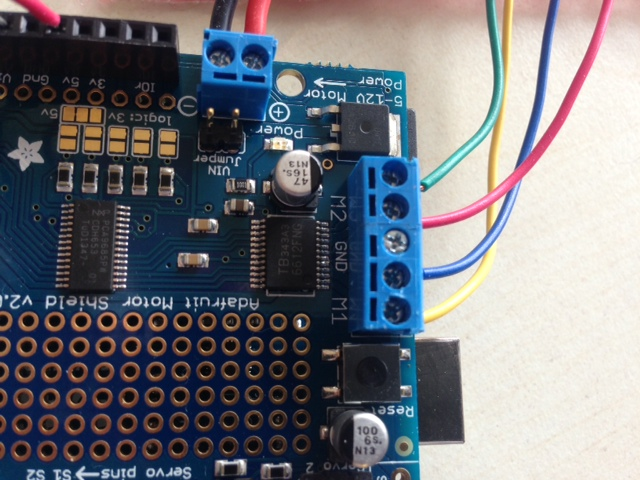
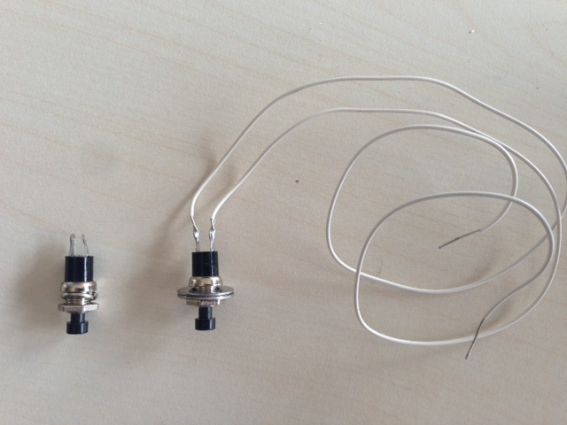
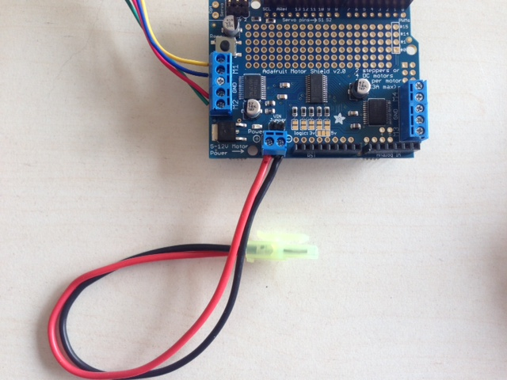
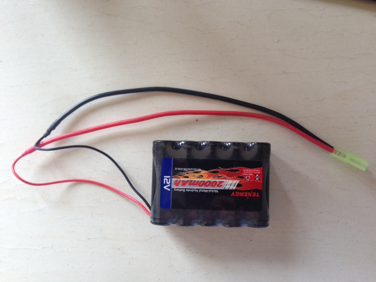

Overview, goals and audience
============================

This lab activity is intended to introduce students to neural engineering in the context of using muscle recordings to control a motor. It is a 2-session activity for rising high-school seniors. At MIT it is part of a 4-wk summer program called the [Women’s Technology Program](http://wtp.mit.edu/) where rising seniors learn about electronics, Python programming, and discrete math. This particular activity comes near the end of the four weeks, thus being able to build on what they have learned.

At MIT each sessions lasts 1:45, and the class of 40 students is split into two groups of 20 and further into 10 teams of 2. Thus 10 setups are needed, though we make 1-2 extra complete setups and then extras of the parts that tend to break, get lost, etc. The activity starts with a broad lunchtime talk on neural engineering to motivate. Then, each lab session starts with a 10-15 min lecture to introduce the lab and get the students thinking, after which they spend the rest of their time doing the lab. In 2014 we found that &gt;90% of groups successfully completed each lab session.

The goals of the activity are to introduce students to:

-   Expose students to neural engineering and sensorimotor neural engineering in particular

-   That muscles make electrical signals, that we can measure these signals and use them to do useful tasks

-   Arduino as a platform for electronics prototyping

Wrestlebrainia itself was originally developed at the University of Washington by Jeremiah Wander, Dev Sarma, and Vivek Paramasivam. Jeremiah Wander helped create a version of Wrestlebrainia at MIT, from which wrestlebrainia\_mini was conceived.

Setup lab kits
==============

The corresponding spreadsheet shows the parts needed and cost. Some parts come in multi-packs and so there is an economy of scale with making more setups. In general, expect each setup to cost ~$200-300. Except for the sensor pads, all parts are reusable, so the running costs should be minimal. We have found most parts to be reliable, especially now that we are using a more robust (and less expensive!) EMG board.

Setting up the lab kits requires basic soldering skills, soldering equipment, and 22 AWG hook-up wire. The setups are:

1.  Solder stacking headers (E4) to each Adafruit motor shield (E2). See instructions [here](https://learn.adafruit.com/adafruit-motor-shield-v2-for-arduino/install-headers#installing-with-stacking-headers), making sure you are at the “Installing with Stacking Headers” portion of the webpage.

2.  Connect the wires from the motor (E1) to the motor shield (E2). You could have the students do this, but we did it beforehand to save some time. Connect yellow and blue wires to M1 terminals (order doesn’t matter) and red and green wires to M2 terminals on motor shield (E2).

> 

1.  Unscrew nut from each button switch (E10), remove the included washer and discard. Slide two washers (M6) onto the switch and reattach the nut to capture the washers. Solder two ~12” wires to each switch. Two button switches are required for each setup.

> 

1.  Connect the mini Tamiya connector (E25) to the power header on the motor shield (E2). We used a connector with 18 AWG wires, which don’t quite fit into the header terminals. We had to use wire snippers to make the leads narrower. Probably would be easier to get connector with 20 AWG wires as described in the parts list spreadsheet. Or if you are feeling confident make your own connectors using Tamiya connector parts.

> 

1.  Solder mini Tamiya connector (E23) to bare leads of 12 V battery (E22). We used heat shrink tubing (E24) to cover the solder connectors to avoid accidentally short-circuiting the battery during use.

> 

1.  Charge the 12V battery (E22) with the charger (E26).

2.  Install Arduino IDE on the computer(s). For Windows, download from [here](http://arduino.cc/en/main/software). We used version 1.6.5.

3.  Install the [motor shield library](https://learn.adafruit.com/adafruit-motor-shield-v2-for-arduino/install-software). Install the [serLCD](http://playground.arduino.cc/Code/SerLCD) library.

4.  Download the Arduino file package and unzip onto each computer.

5.  Download and print out the handouts.
