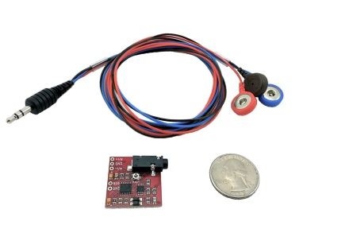
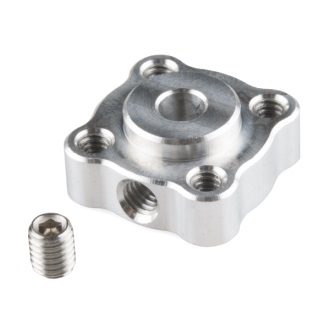
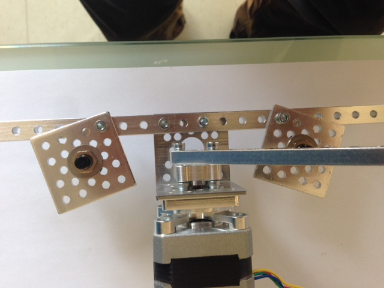

Getting Started
===============

You will need the following parts, which should be located in your bin.

|                                  |                                                    |                     |                             |
|----------------------------------------------------------|----------------------------------------------------------------------------|---------------------------------------------|-----------------------------------------------------|
| Arduino microcontroller board (our miniature computer)   | EMG muscle sensor (measures the tiny electrical signals from your muscles) (x2) | EMG muscle sensor button cable w/ mini-plug (x2) | Motor driver board (electronics to drive the motor) |
|                                                          |                                                                            |                                             |                                                     |
|                                  |  |                     |                             |
| Sensor pads (connect the EMG muscle sensor to your skin) | 9V battery + plug |  Motor                                       | 12V battery for motor                               |
|                                                          |                                                                            |                                             |                                                     |
|                    |                  |  |   |  
| LCD display + JST cable                     | Pushbutton switches on square plates (x2) | Right-angle brackets (x2) | Motor mount|
|                                 |                                                   |                    |                            |
| Aluminum beams (x2)                                      | Screws                                                                     | Motor hub                                   | Breadboard                                          |
|                                                          |                                                                            |                                             |                                                     |
|                                 |                                                   |                  |                                                     |
| 3/32” and 7/64” Hex wrenches                             | Screwdriver                                                                | 1 kOhm resistors (x2)                              |                                                     |

Build the arm setup
===================

Let’s assemble Wrestlebrainia mini. There are a number of ways to put it together. Check out the pictures below of the assembled version, and along with the assembled version provided, use that as a guide.

1.  Connect the circuits
    ====================

    1.  We are using four circuit boards for this lab, and they should already be assembled together.  

	  

	1.  Connect the four wires from the motor to the motor shield as shown in the diagram below.

	  

	1.  Connect the two pushbutton switches and resistors as shown in the schematic below. Looking at Wrestlebrainia mini head-on, the circuit for the pushbutton on the left should go to digital pin 2, and the one on the right to digital pin 1.

	1. Connect the three wires of the LCD display to the protoboard and to the top EMG board as shown in the schematic below.  The white wire from the LCD display should go to digital pin 8.

	 

	1.  Connect the two mini-plugs from the EMG muscle sensor button wires to the EMG muscle sensor board. The final setup should look like this image below:

	 

	1.  Attach three sensor pads to one of your teammates’ forearm or bicep muscles as shown below. One of the pads should go on the center of the muscle, one near the end of the muscle, and the third on the bony part of your elbow.

	

	1.  Clip the three sensor buttons from the EMG muscle sensor wires to the pads on your bicep/forearm, with the black sensor button (reference button) attached to the pad near your elbow.

	

	1.  Repeat this process for another teammate.

	1.  Now connect the Arduino to the 9V battery w/ plug, and connect the 12V battery to the motor 

Wrestle!
========

1.  You are now ready to wrestle!

2.  If you are interested in how the code works, it reads the two EMG signals, then maps them to a scale defined by the noise and max calibration values as shown below.

	

Then the code compares the two EMG signals and the bigger one determines the motor direction and velocity. Every few milliseconds, the code checks to see if one of the pushbuttons has been pushed. If so, the motor arm back and forth indicating the end of the round. If there is no winner, we loop through again.

Clean up
========

Please take everything apart and put it back neatly in the bin, as you found it.
