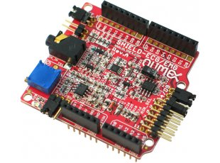
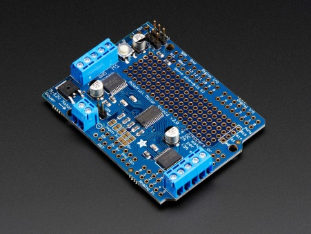
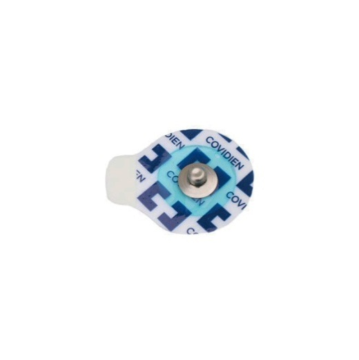
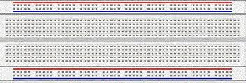
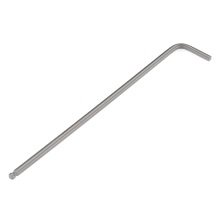

Getting Started
===============

You will need the following parts, which should be located in your bin.

|                                  |                                                    |                     |                             |
|----------------------------------------------------------|----------------------------------------------------------------------------|---------------------------------------------|-----------------------------------------------------|
| Arduino microcontroller board (our miniature computer)   | EMG muscle sensor (measures the tiny electrical signals from your muscles) (x2) | EMG muscle sensor button cable w/ mini-plug (x2) | Motor driver board (electronics to drive the motor) |
|                                                          |                                                                            |                                             |                                                     |
|                                  |  |                     |                             |
| Sensor pads (connect the EMG muscle sensor to your skin) | 9V battery + plug |  Motor                                       | 12V battery for motor                               |
|                                                          |                                                                            |                                             |                                                     |
|                    |                  |  |   |  
| LCD display + JST cable                     | Pushbutton switches on square plates (x2) | Right-angle brackets (x2) | Motor mount|
|                                 |                                                   |                    |                            |
| Aluminum beams (x2)                                      | Screws                                                                     | Motor hub                                   | Breadboard                                          |
|                                                          |                                                                            |                                             |                                                     |
|                                 |                                                   |                  |                                                     |
| 3/32” and 7/64” Hex wrenches                             | Screwdriver                                                                | 1 kOhm resistors (x2)                              |                                                     |

Build the arm setup
===================

Let’s assemble Wrestlebrainia mini. There are a number of ways to put it together. Check out the pictures below of the assembled version, and along with the assembled version provided, use that as a guide.

1.  Connect the circuits
    ====================

    1.  Attach the motor driver board to the Arduino microcontroller board by aligning the pins from the motor driver board with the black headers on the Arduino board and pushing the two boards together. The motor driver board is called a *shield*, in that it fits on top of the Arduino, kind of like a shield.

>  

1.  The four wires from the motor should be connected to the motor shield as shown above.

2.  Attach the two power wires to the shield as shown above.

3.  Connect the two pushbutton switches as shown in the figure below. Looking at Wrestlebrainia mini head-on, the circuit for the pushbutton on the left should go to digital pin 2, and the one on the right to digital pin 1.

> 

1.  Attach the EMG sensors
    ======================

    1.  Connect the mini-plug from the three EMG muscle sensor electrode wires to the EMG muscle sensor board, and connect the two 9V batteries to the battery caps from the EMG muscle sensor. Repeat for the other sensor.

> 

**Need to update this picture**

1.  Attach three sensor pads to one of your teammates’ forearm or bicep muscles as shown below. One of the pads should go on the center of the muscle, one near the end of the muscle, and the third on the bony part of your elbow.

1.  Clip the three sensor buttons from the EMG muscle sensor wires to the pads on your bicep/forearm, with the black sensor button (reference button) attached to the pad near your elbow.

> 

1.  Repeat this process for another teammate.

2.  Now connect the Arduino to the 9V battery w/ plug.

<!-- -->

1.  Wrestle!
    ========

    1.  You are now ready to wrestle!

    2.  If you are interested in how the code works, it reads the two EMG signals, then maps them to a scale defined by the noise and max calibration values as shown below.

> a
>
> Then the code compares the two EMG signals and the bigger one determines the motor direction and velocity. Every few milliseconds, the code checks to see if one of the pushbuttons has been pushed. If so, the motor arm back and forth indicating the end of the round. If there is no winner, we loop through again.

Clean up
========

> Please take everything apart and put it back neatly in the bin, as you found it.
